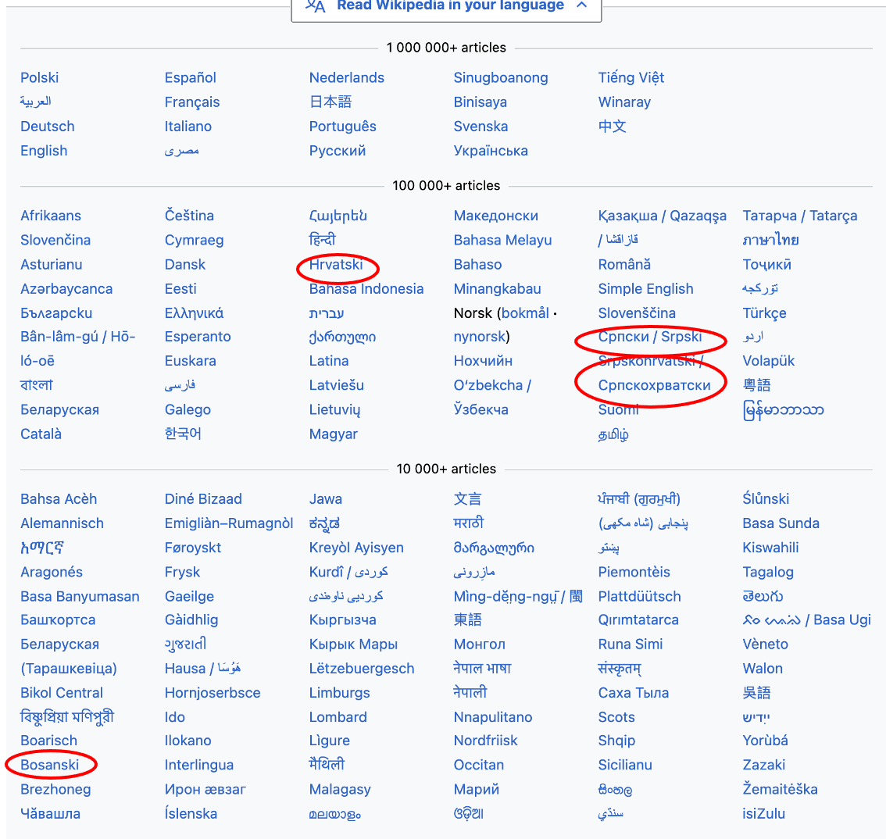
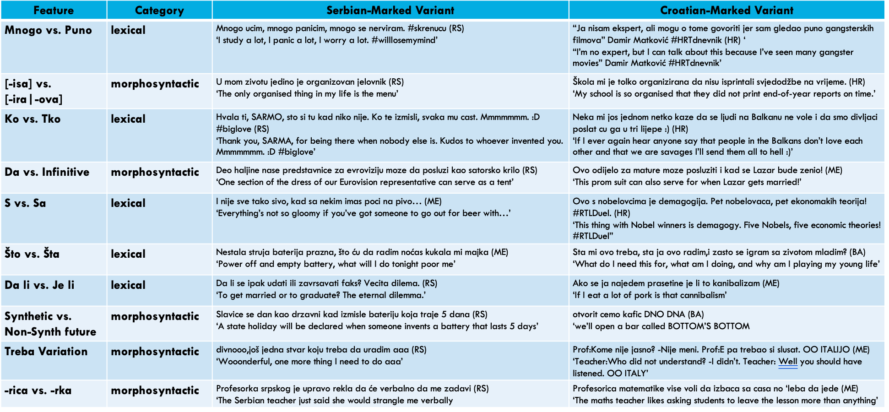
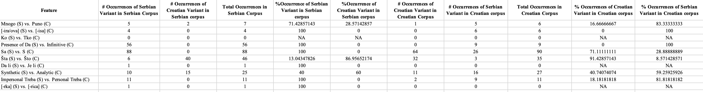

Final Report
================
Joe Patrick
12/15/2021

-   [Introduction](#introduction)
-   [Background](#background)
-   [Data](#data)
-   [Method](#method)
-   [Discussion and Difficulties](#discussion-and-difficulties)
-   [Conclusion](#conclusion)
-   [References](#references)
-   [Appendix](#appendix)

# Introduction

Dialectal variation in language has long been an object of interest for
sociolinguists- spanning seemingly disparate fields of linguistics and
contributing many of the foundational discoveries of the field. This
project takes a limited set of language features commonly understood to
distinguish among the varieties of the Western Balkan languages of
Former Yugoslavia and applies them to Wikipedia data. The present study
was inspired by Ljubešić, N., Miličević Petrović, M., & Samardžić, T.
(2018) who look at a set of 16 linguistic features as they pattern on
Twitter through informal speech. These features were chosen from a
variety of textbooks and grammars, which represent canonical differences
between the languages of Bosnia, Croatia, Montenegro, and Serbia. This
study looks at the effect of genre and formality to identify whether the
same features could be found in Wikipedia articles as on Twitter feeds.

# Background

Language in the Balkans has always been a somewhat divisive issue. As
the crossroads between Europe and Asia and the site where two major
empires, Austro-Hungarian and Ottoman, vied for land and subjects, the
resulting identity of the contemporary nations is complicated, to say
the least. World War I provoked, among other things, a desire for the
disparate South Slavic nations to unite. These states did unite and in
doing so, formed the large country of ‘Yugoslavia’ or ‘Land of the South
Slavs.’ Following a series of wars in the early 1990s, this super state
of Yugoslavia found itself disintegrating, with each of its six member
states opting to exit the federation and pursue independence. In this
effort, a language and culture that was once more unified (at least in
theory) became fragmented. The previous moniker for the standard
language spoken in this region was no longer appropriate- what is
‘Serbo-Croatian’ when you suddenly have Bosnians, Bosniaks, Bosnian
Serbs, Montenegrins, Montenegrin Serbs, Serbian Montenegrins, et cetera.

The following two images show quite clearly how the region that was once
the single country of Yugoslavia separated into its constituent parts
and left behind a complicated social situation of national, ethnic, and
linguistic identities:

(above) The make-up of the Balkans during World War II  
(below) The Balkans as of 2006; regions divided based on census
responses to a question about language identity

While most traditional dialectology projects tend to take place ‘on the
ground’ with live speakers in the region of interest, it is impossible
to ignore the role of the internet as a communicative medium in the last
few decades. Wikipedia is an online, collaborative, open source
encyclopedia in which practically anyone can create or add to an article
and in theory, inaccuracies will be corrected by other users
participating in the collaboration. As a multilingual source, Wikipedia
offers domains in hundreds of languages of all sizes, origins, and
political power. See the image below for an example of language options
on Wikipedia. Note that for the Slavic languages of the Western Balkans
there are four domains available: Croatian (Hrvatski), Bosnian
(Bosanski), Serbian (Српски), and Serbo-Croatian (Srbo-Hrvatski).

Users of Wikipedia have to make an initial choice of which language
domain to contribute to, thus starting the collaborative process with a
highly ideological decision. This project attempts to determine, in
short, how Serbian the Serbian Wiki is versus how Croatian the Croatian
Wiki is.

# Data

To test out my hypothesis, I made corpora out of five articles taken
from Wikipedia. The articles covered the topics of: \* *Kosovo, Ustase,
Cetnici, The Orthodox Church in Montenegro, and Nationalism* \* and were
matched for Serbian and Croatian versions taken from the respective
Wikis. The original 16 features used by Ljubešić, N., Miličević
Petrović, M., & Samardžić, T. (2018) are reduced to 10 features for ease
of collection. See appendix for list of original 16 features.

# Method

For this study, data processing was accomplished through the R
statistical language using the RStudio interface. Articles comprising
the Croatian and the Serbian corpora were collected based on topics
likely to evoke regionally standard forms- largely topics covering
politically or culturally controversial topics, such as Kosovo, World
War II, and specific WWII nationalist parties currently salient in
contemporary recreated forms. Regular expressions were used to pattern
match expected features and counts of feature presence/absence were
collected.

# Discussion and Difficulties

The data table below shows that the strongest patterns identified were
the use of intensifying adverbs mnogo/puno, the use of preposition s/sa,
use of question word što/šta, ‘treba’ variation, and finally a moderate
difference in the use of synthetic versus analytic future tense.

The goal of this project was to build a method of collecting dialect
data on Wikipedia, which is an understudied but valuable source of
variation. Previous work contributes to the study of dialect on Twitter,
an informal, fast-paced, and conversational medium where users produce
individual messages for which they are responsible. As an educational
resource, Wikipedia is a more formal genre. The nature of the
collaboration requires that the ‘final message’ of an article is
constructed over time. And importantly, editors on Wikipedia are largely
anonymous. Whereas there may be a danger for an individual to use highly
dialectal/regional forms on Twitter (consider stereotypes of nationalist
ideologies and lack of sophistication often accompany heavy regional
dialects), on Wikipedia users may not have as much incentive to
self-monitor.

Most difficulties for this project revolved around the proper way to
efficiently collect data from Wikipedia texts. The first challenge was
to learn how to import the body text of Wikipedia articles. Following
that, the collection of data was solely reliant on use of regular
expressions. Oftentimes the regexes overgeneralized and overproduced
data which then had to be manually edited. This editing process relied
solely on my language ability and use of linguistic resources around me,
with no secondary checker to measure interrater reliability. Finally,
some of the regexs are more simple, for lack of a better term, and are
more likely to accurately provide the data they are intended to collect.
This means that some features may be overrepresented and thus, may seem
more regionally-marked than in actuality.

# Conclusion

There is still much to do in the field of internet dialectology. This
study is a brief foray into dialect variation in the Balkans- a highly
studied area when it comes to traditional variation. However, it seems
for some features- especially use of prepositional s vs. sa and što
vs. šta- they are well-represented. The former following dialectal
expectations and the latter mostly producing one variable- the
prescriptively standard variant.

# References

Četnici. (n.d.). In Wikipedia. Retrieved December 8th, 2021, from
<a href="https://hr.wikipedia.org/wiki/Četnici" class="uri">https://hr.wikipedia.org/wiki/Četnici</a>  
Четници. (n.d.). In Wikipedia. Retrieved December 8th, 2021, from
<a href="https://hr.wikipedia.org/wiki/Четници" class="uri">https://hr.wikipedia.org/wiki/Четници</a>  
Kosovo. (n.d.). In Wikipedia. Retrieved December 8th, 2021, from
<https://hr.wikipedia.org/wiki/Kosovo>  
Косово. (n.d.). In Wikipedia. Retrieved December 8th, 2021, from
<a href="https://sr.wikipedia.org/wiki/Косово" class="uri">https://sr.wikipedia.org/wiki/Косово</a>  
Ljubešić, N., Miličević Petrović, M., & Samardžić, T. (2018). Borders
and boundaries in Bosnian, Croatian, Montenegrin and Serbian: Twitter
data to the rescue. Journal of Linguistic Geography, 6(2), 100-124.
<doi:10.1017/jlg.2018.9>  
Nacionalizam. (n.d.). In Wikipedia. Retrieved December 8th, 2021, from
<https://sr.wikipedia.org/wiki/Nacionalizam>  
Национализам. (n.d.). In Wikipedia. Retrieved December 8th, 2021, from
<https://sr.wikipedia.org/wiki/> Национализам  
Pravoslavna crkva u Crnoj Gori. (n.d.). In Wikipedia. Retrieved December
8th, 2021, from
<https://hr.wikipedia.org/wiki/Pravoslavna_crkva_u_Crnoj_Gori>  
Православна црква у Црној Гори. (n.d.). In Wikipedia. Retrieved December
8th, 2021, from
<a href="https://sr.wikipedia.org/wiki/Православна_црква_у_Црној_Гори" class="uri">https://sr.wikipedia.org/wiki/Православна_црква_у_Црној_Гори</a>  
Serbo-Croatian. (n.d.). In Wikipedia. Retrieved December 8th, 2021, from
<https://en.wikipedia.org/wiki/Serbo-Croatian>  
Ustaše. (n.d.). In Wikipedia. Retrieved December 8th, 2021, from
<a href="https://hr.wikipedia.org/wiki/Ustaše" class="uri">https://hr.wikipedia.org/wiki/Ustaše</a>  
Усташе. (n.d.). In Wikipedia. Retrieved December 8th, 2021, from
<a href="https://sr.wikipedia.org/wiki/Усташе" class="uri">https://sr.wikipedia.org/wiki/Усташе</a>

# Appendix

Features measured in Ljubešić, N., Miličević Petrović, M., & Samardžić,
T. (2018):

